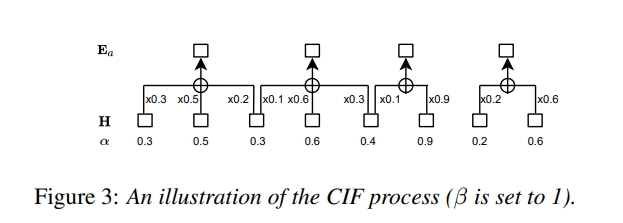
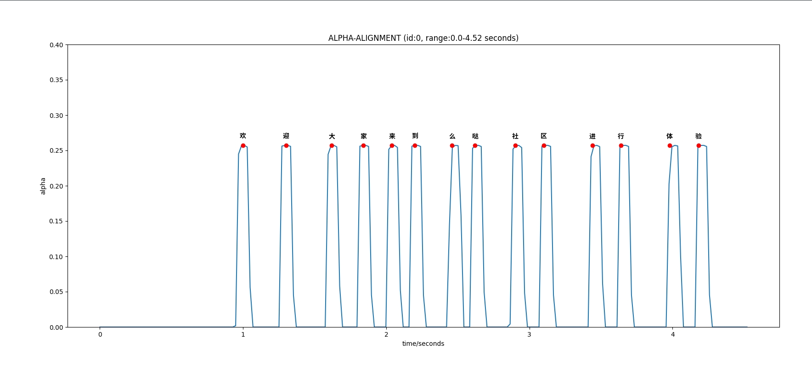

# 基于Paraformer的alpha-token强制对齐

### 1. 基本原理

CIF 作为Parafoemr的核心模块，用于预测字数和生成声学向量，从而实现了单轮非自回归解码。其中字数的预测主要通过encoder输出系数alpha的累计得分，满足通关阈值β=1.0即可产生一个token，其中alpha曲线在一定程度上呈现着vad效果，或者依次进行断句。

### 2. alpha-token 强制对齐 
cif的时间戳对齐采用peak（通关方式）得到，这里我们直接尝试alpha-token对齐方式，将识别的token在编码器输出上进行对齐，其中对齐算法采用动态规划。具体参考main.py中的maxSumSubarrayWithGaps()。

以10s窗长进行音频切块，下面展示alpha-token 的对齐效果：

用户可以修改main.py 参数进行试验
### 3. alpha VAD
    开发中